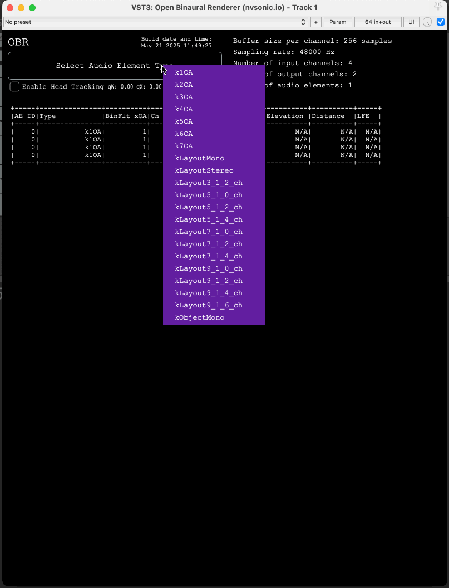

# Open Binaural Renderer VST3 Plugin

This is a VST3 plugin wrapper for [Open Binaural Renderer](https://github.com/google/obr), a library for rendering 3D audio in a binaural format. This plugin allows you to use Open Binaural Renderer in your favorite digital audio workstation (DAW) that supports VST3 plugins.



## Head tracking OSC input

The plugin supports head tracking via OSC messages. The OSC messages should be sent to the plugin (port `12345`) using the following format:

```
/quaternion, qW, qX, qY, qZ
```

Where `qW`, `qX`, `qY`, and `qZ` are the components of the quaternion representing the head orientation. Use the following reference frame:
* X - right
* Y - up
* Z - front

## Platform support

The plugin has been tested on MacOS.